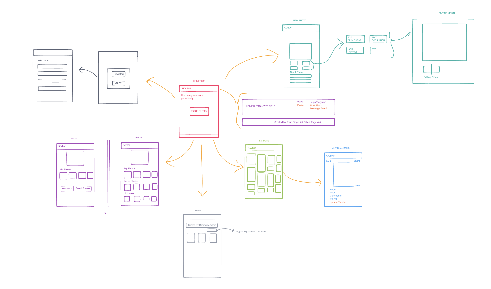
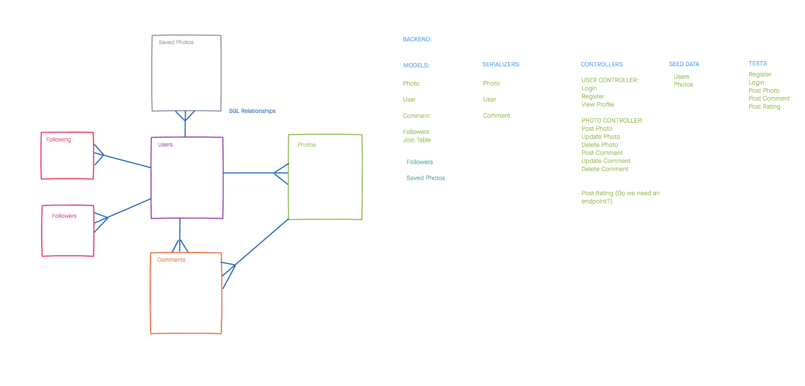
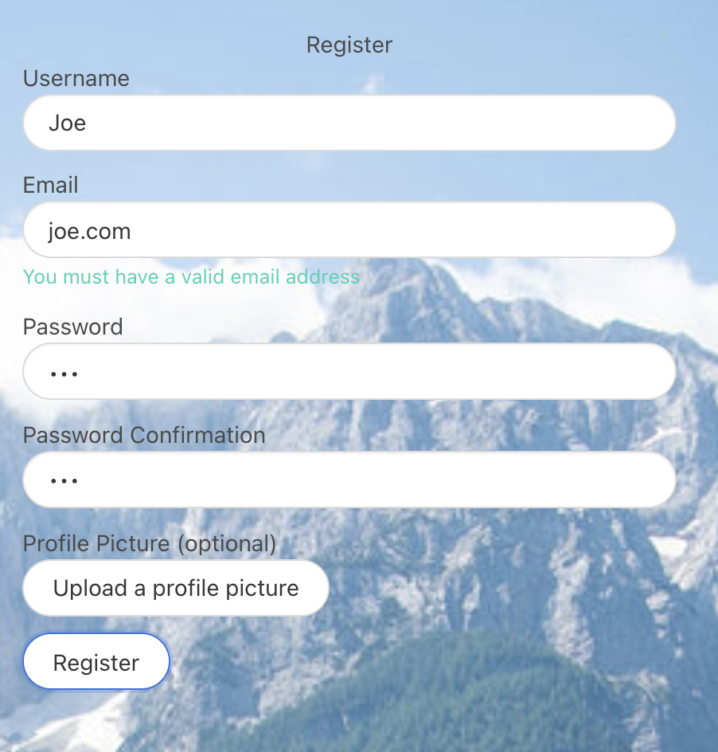

###  General Assembly, Software Engineering Immersive

# Project 4: Picster


## The Overview:

As a group of three we were tasked with creating a full stack application using a Python with Flask back end and a React front end. We were given 5 days to complete the project. We decided on building a photo editing and sharing app, to see if we could build the same functionality as some of the most popular social media platforms. 

You can check out the website here: [Picster](https://picster-gaproject.herokuapp.com/)

### The Brief
- Build a full-stack application by making your own backend and your own front-end
- Use a Python Flask API using a Flask REST Framework to serve your data from a Postgres database
- Consume your API with a separate front-end built with React
- Be a complete product which most likely means multiple relationships and CRUD functionality for at least a couple of models
- Implement thoughtful user stories/wireframes that are significant enough to help you know which features are core MVP and which you can cut
- Have a visually impressive design to kick your portfolio up a notch and have something to wow future clients & employers
- Be deployed online so it's publicly accessible

### Technologies Used:
- HTML5
- CSS3
- SCSS
- ES6
- Git
- Github
- React.js
- React Router
- Node.js
- Python
- Pytest
- Flask
- Marshmallow
- SQAlchemy
- PostgreSQL
- Bulma
- Axios
- Bcrypt
- jsonwebtokekn
- ToastUI
- Cloudinary

### Planning:
We used InVision to whiteboard out our project and plan each day / split tasks.

Here was our user story whiteboard, which we did intialy to then work out what componenents we needed for both our back end and front end:



And our SQL and Back end Plan:

 

## The Back End

We built the backend using a combination of Flask Python and PostgreSQL.

### Models and Serializers

We used three models: 'photo', 'user' and 'comment'. We also implemented a 'followers table' to allow users to follow each other and be followed:
```
    following_current_user = db.relationship('Following', backref='following_current_user', foreign_keys = 'Following.following_current_user_id')
    following_users = db.relationship('Following', backref='following_user', foreign_keys = 'Following.following_user_id ')
```

### Controllers

We used two controller files: 'photo', enabling a user to GET, POST, PUT and DELETE their image and comments from the site and 'user' for the purposes of signup, login, editing and deleting a profile. 

Here is an example of the POST route for an image:
```
@router.route("/photos", methods=["POST"])
@secure_route
def upload_photo():
    photo_dictionary = request.json
    try:
        photo = photo_schema.load(photo_dictionary)
        photo.user = g.current_user
    except ValidationError as e:
        return {"errors": e.messages, "messages": "Something went wrong!"}
    photo.save()
    return photo_schema.jsonify(photo), 200
```
We added a decorator to this route to ensure that the user is logged in and has permission to post a photo and used a try catch to catch any validation errors.

### Testing

We set up the backend of our site within the first 24 hours of starting this project, and so we were keen to develop a test suite using pytest to ensure that our API returned the expected results before moving onto the frontend development. We created tests for users, comments and photos - here is an example of our upload photo test:

```
def test_upload_photo():
    client = app.test_client()
    token = login(client)
    photo_data = {"url": "https://photo.com", "caption": "Great photo", "rating": 4}
    request_headers = {"Authorization": f"Bearer {token}"}
    photo_response = client.post(
        "/api/photos",
        data=json.dumps(photo_data),
        content_type="application/json",
        headers=request_headers,
    )
    assert photo_response.json["caption"] == "Great photo"
```

For all of us it was the first time implementing test driven development in Python instead of Javascript and we took pride in each composing a test suite for different models, schemas and controllers. 

## The Front End

The Frontend was built using React. We began working on it after we had predominantly completed the backend. Before starting, we planned out each day what we wanted to achieve and divided up components to work on between the three of us. 

We used Cloudinary and integrated the Toast UI library in order to allow for picture upload and editing, in turn any picture you uploaded to the site will automatically appear on the Explore page. This was challenging and currently users can only edit photos on desktop, not mobile.

Here is a screenshot of the image editor itself:


We wanted the styling of Picster to be clean and similar to that of Instagram / Pinterest. Tash and Emily took ownership of the overall style of the website and worked with Bulma and SCSS to create a global style and the easy and vibrant user experience. We implemented some custom SCSS for our Explore page. As we allowed users to upload images of any size, we wanted these to be displayed dynamically, depending on their aspect ratio:

```
#photos {
  line-height: 0;
  column-count: 3;
  column-gap: 10px;
}

#photos img {
  width: 100% !important;
  height: auto !important;
  margin: 5px;
  border-radius: 10px;
}
```

We also wanted to ensure that our site included error handling, this was particularly important on the register page. 

This code shows front end validation for password confirmation, but also our try/catch code, which attempts a registration and if any errors are met on the back end, they are passed to a piece of state called 'regErrors', which displays them to the user. This includes non-unique user names and non-valid email addresses.

```
async function handleSubmit(event) {
    event.preventDefault()
    if (passwordConfirmationData.passwordConfirmation !== regData.password) {
      updateRegErrors({ ...regErrors, ['passwordConfirmation']: 'Password did not match' })
      return
    }
    console.log(regData)
    try {
      await axios.post('/api/signup', regData)
      updateRegistrationSuccess(true)
      history.push('/login')
    
    } catch (err) {
      updateRegErrors(err.response.data)
    }
  }
  ```
  These errors are rendered on the front page as so:
  
  
  
## Challenges
Our biggest challenge on the back end was creating the correct relationship to allow users to follow each other. After experiementing with a one-top-many relationship for each user, it became clear a join table would be more suited. This was implemented and the schema created so not only could we see followers on the front end, but also see their images, their IDs, and link to their profiles. 

## Wins
- It was always our intent to offer some photo editing for our users, such as adding filters, or basic manipulation. Settling on ToastUI, we integrated this library and the end result works really well, except for one small bug! Half way through the project, ToastUI inplemented an update which disabled the space bar on our website, so we had to write a small message to ask users to refresh their page after upload to allow them to type correctly. We are hoping by the time you read this ToastUI have fixed the bug
- Taking inspiration from Pinterest, we wanted our users to be able to upload photos of any aspect ratio and have them fit seamlessly together. In the end we wrote some custom CSS for this:
 
- Knowing that everyone likes to take and upload pictures on their phones, we wanted to make Picster mobile friendly. Using Bulma's responsive framework designs, we all made sure that each page we created was scaleable for mobile. The only feature we weren't able to make mobile friendly was our image editor

## Key Learnings
- After learning Python for a week and a half prior to starting this project, it was great to put what I had learnt into practice 
- I developed a test suite using the pytest framework, to ensure our comment endpoints correctly returned the expected response. This was great, as I wasn't confident in writing tests before the project
- This definitely further solidified my understanding of React 

## Future Features
- Given more time, we would have created an image editor which worked on mobile
- We would have loved to add more user actions, including an instant messenger, or at least a mail messenger system. We looked at creating the necessary back end models for messenging, but had to prioritise the main funcitonality first
- We would also like to implement a changeable timeline, so you can either see 'all photos' posted to the home page, or just your 'follower photos'
